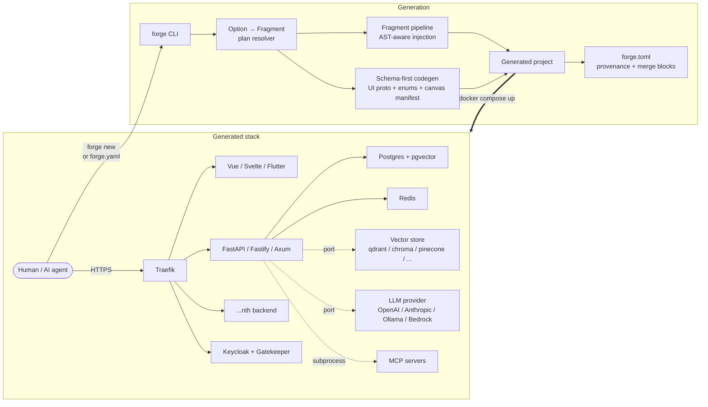

<div align="center">

# forge

*The single-command, polyglot full-stack generator for production services, agent platforms, and RAG apps.*

[](https://github.com/cchifor/forge)
[](https://www.python.org)
[](LICENSE)
[](https://github.com/cchifor/forge)
[](https://github.com/cchifor/forge/actions)
[](docs/FEATURES.md)
[](docs/FEATURES.md)
[](docs/FEATURES.md)
[](CONTRIBUTING.md)

</div>

> **1.1.0-alpha.2 is on `main`.** File-level three-way merge for `forge --update` (default `--mode merge`, with `.forge-merge` sidecars on conflict), declarative `compose.yaml` snippets in fragments, plugin SDK with a dedicated end-to-end CI gate (`.github/workflows/plugin-e2e.yml`), and six new CLI verbs (`--plan-update`, `--remove-fragment`, `--mode={merge,skip,overwrite}`, `--graph` for Mermaid plan output, `--log-json`, `--log-level`). The 1.0.x core remains: schema-first UI protocol JSON Schemas + entity YAML DSL, provenance manifest, entry-point plugin SDK, LibCST Python AST injection, three-zone merge for injection blocks, reliability / observability / security fragments, published canvas packages (Vue / Svelte / Dart), and the introspection verbs (`--doctor`, `--plan`, `--dry-run`, `--preview`, `--canvas lint`, `--plugins list`, `--migrate`, `--new-entity-name`, `--add-backend-language`). See [`CHANGELOG.md`](CHANGELOG.md), [`RELEASING.md`](RELEASING.md), [`UPGRADING.md`](UPGRADING.md), and the [RFCs](docs/rfcs/).

`forge` is a CLI that scaffolds production-ready full-stack platforms from a single YAML (or a single interactive run). Where [create-next-app](https://nextjs.org/docs/app/api-reference/cli/create-next-app) and [cookiecutter-fastapi](https://github.com/tiangolo/full-stack-fastapi-template) give you one frontend and one backend, forge combines three backends ([FastAPI](https://fastapi.tiangolo.com/), [Fastify](https://fastify.dev/), [Axum](https://github.com/tokio-rs/axum)), three frontends ([Vue 3](https://vuejs.org/), [Svelte 5](https://svelte.dev/), [Flutter](https://flutter.dev/)), enterprise auth ([Keycloak](https://www.keycloak.org/) + [Gatekeeper](https://gatekeeper.readthedocs.io/) + [Traefik](https://traefik.io/)) and a typed 22-option registry (NixOS / Terraform style — dotted paths, JSON-Schema export) — then wires them behind one reverse proxy with Docker Compose. It's designed to be driven by humans in a terminal **and** by autonomous AI agents through a headless, stdin-pipeable, JSON-first CLI, so CI pipelines, Claude Code, or Copilot workspaces can generate the same project you would.

---

## Architecture



See [`docs/ARCHITECTURE.md`](docs/ARCHITECTURE.md) for the internals (registries, injector backends, provenance, codegen). See [`docs/GETTING_STARTED.md`](docs/GETTING_STARTED.md) for the 10-minute tour.

---

## Options

Everything configurable is an `Option` with a dotted path, a type (`bool` / `enum` / `int` / `str`), and a default. Set one at generation time with `--set PATH=VALUE` (repeatable) or in the `options:` block of your YAML config. See [Usage Examples](#usage-examples).

| Category | Capability | Option path | Type | Default | Backends | What you get |
|---|---|---|---|---|---|---|
| **Foundation** | Polyglot backends | — | — | — | python, node, rust | [FastAPI](https://fastapi.tiangolo.com/) / [Fastify](https://fastify.dev/) / [Axum](https://github.com/tokio-rs/axum) with matching ORM + migrations + lint/test toolchain. |
| **Foundation** | Frontends | — | — | — | vue, svelte, flutter | [Vue 3](https://vuejs.org/) + Vite + TanStack Query, [SvelteKit](https://svelte.dev/) + runes, [Flutter](https://flutter.dev/) (web) + Riverpod. All ship an [AG-UI](https://github.com/cchifor/ag-ui) chat panel. |
| **Foundation** | Docker-compose + Traefik | — | — | — | all | Generated `docker-compose.yml` with [Traefik](https://traefik.io/) routing `/api/{backend}` per-service. Multi-backend + per-service migrations included. |
| **Foundation** | Enterprise auth | — | — | — | all | [Keycloak](https://www.keycloak.org/) realm JSON validated at generate-time, [Gatekeeper](https://gatekeeper.readthedocs.io/) OIDC ForwardAuth, Traefik forward-auth middleware. |
| **Foundation** | `forge.toml` stamping | — | — | — | all | Project records forge version + template paths + fully-resolved option map; machine-readable for `forge --update`. |
| **Observability** | Request Tracing | `middleware.correlation_id` | enum | `always-on` | python | X-Request-ID ingress + ContextVar + response echo. |
| **Observability** | Deep Health Checks | `observability.health` | bool | `false` | python, node, rust | `/health` aggregates Postgres + Redis + Keycloak readiness. |
| **Observability** | Distributed Tracing | `observability.tracing` | bool | `false` | python, node, rust | [Logfire](https://logfire.pydantic.dev/) (Py) / [`@opentelemetry/sdk-node`](https://opentelemetry.io/docs/languages/js/) (Node) / OTLP gRPC via [`tracing-opentelemetry`](https://crates.io/crates/tracing-opentelemetry) (Rust). |
| **Observability** | OpenTelemetry agent spans | `observability.otel` | bool | `false` | python | OTLP exporter + FastAPI/HTTPX instrumentations + `agent.run` / `tool.call` spans with token-cost attributes. |
| **Observability** | SBOM workflow | `security.sbom` | bool | `false` | python | `.github/workflows/sbom.yml` emits a CycloneDX SBOM + weekly pip-audit report. |
| **Reliability** | Rate Limiting | `middleware.rate_limit` | bool | `true` | python, node, rust | Token-bucket limiter: in-memory (Py), [`@fastify/rate-limit`](https://github.com/fastify/fastify-rate-limit) (Node), Axum tower middleware (Rust). |
| **Reliability** | Security Headers | `middleware.security_headers` | bool | `true` | python, node, rust | CSP, X-Frame-Options, X-Content-Type-Options, Referrer-Policy, HSTS on HTTPS responses. |
| **Reliability** | PII Scrubber | `middleware.pii_redaction` | bool | `true` | python | stdlib logging filter that scrubs emails, bearer tokens, API keys before handlers run. |
| **Reliability** | Response Cache | `middleware.response_cache` | bool | `false` | python, node | `fastapi-cache2` + Redis (Py) / `@fastify/caching` (Node). |
| **Reliability** | Connection Pool | `reliability.connection_pool` | bool | `true` | python | Production-ready SQLAlchemy async pool defaults (size 20 / overflow 10 / pre-ping / 30-min recycle) with env-var overrides. |
| **Reliability** | Circuit Breaker | `reliability.circuit_breaker` | bool | `false` | python | [purgatory](https://pypi.org/project/purgatory/)-backed breaker for outbound HTTP — LLM, vector store, auth. |
| **Async Work** | Task Queue | `async.task_queue` | bool | `false` | python, node, rust | [Taskiq](https://taskiq-python.github.io/) broker (Py) / [BullMQ](https://docs.bullmq.io/) + ioredis (Node) / [Apalis](https://github.com/geofmureithi/apalis) + Redis (Rust). |
| **Async Work** | Knowledge Ingest Queue | `async.rag_ingest_queue` | bool | `false` | python | Taskiq tasks for off-thread RAG ingestion. |
| **Async Work** | Queue Backend (port) | `queue.backend` | enum | `none` | python | `none` / `redis` / `sqs` — backs the `QueuePort` for delayed delivery + FIFO use cases. |
| **Conversational AI** | Chat History | `conversation.persistence` | bool | `false` | python | SQLAlchemy `Conversation`/`Message`/`ToolCall` + Alembic migration. |
| **Conversational AI** | Tool Registry | `agent.tools` | bool | `false` | python | Tool base class + process-wide registry + pre-baked `current_datetime` + `web_search` + `/api/v1/tools` endpoint. |
| **Conversational AI** | Agent Stream | `agent.streaming` | bool | `false` | python | `/api/v1/ws/agent` WebSocket with typed event protocol (`text_delta`, `tool_call`, `tool_result`, `agent_status`, …) and a runner-dispatch module. |
| **Conversational AI** | LLM Agent | `agent.llm` | bool | `false` | python | [pydantic-ai](https://ai.pydantic.dev/) LLM loop — Anthropic / OpenAI / Google / OpenRouter. |
| **Conversational AI** | LLM Provider (port) | `llm.provider` | enum | `none` | python | `none` / `openai` / `anthropic` / `ollama` / `bedrock` — backs the `LlmProviderPort`; swap providers via env, no regen. |
| **Conversational AI** | Chat Attachments | `chat.attachments` | bool | `false` | python | `/api/v1/chat-files` multipart endpoint + `ChatFile` model + local storage. |
| **Conversational AI** | MCP scaffolds | `platform.mcp` | bool | `false` | python (Vue UI) | `/mcp/tools` + `/mcp/invoke` router plus Vue ToolRegistry + ApprovalDialog components. |
| **Knowledge** | Vector-store backend | `rag.backend` | enum | `none` | python | Pick one of: `none`, `pgvector`, `qdrant`, `chroma`, `milvus`, `weaviate`, `pinecone`, `postgresql`. Bundles the matching fragment + `rag_pipeline` + `conversation.persistence`. |
| **Knowledge** | Embeddings provider | `rag.embeddings` | enum | `openai` | python | `openai` (text-embedding-3-small) or `voyage` (voyage-3.5). |
| **Knowledge** | Reranker | `rag.reranker` | bool | `false` | python | Cohere `rerank-v3.5` + local sentence-transformers cross-encoder fallback. |
| **Knowledge** | Top-K chunks | `rag.top_k` | int (1–100) | `5` | python | Default number of chunks returned per RAG query. |
| **Platform** | Admin Console | `platform.admin` | bool | `false` | python | [SQLAdmin](https://aminalaee.dev/sqladmin/) UI at `/admin`, env-gated (`dev`/`all`/`disabled`). |
| **Platform** | Outbound Webhooks | `platform.webhooks` | bool | `false` | python, node, rust | CRUD registry + HMAC-SHA256 signed outbound delivery + `/test` endpoint. |
| **Platform** | Service CLI Extensions | `platform.cli_extensions` | bool | `false` | python | Typer subcommands: `app info`, `app tools`, `app rag ingest`. |
| **Platform** | AI Agent Handbook | `platform.agents_md` | bool | `true` | any (project-scoped) | Drops `AGENTS.md` + `CLAUDE.md` at the project root so AI coding agents orient themselves before editing. |
| **Platform** | Object Store (port) | `object_store.backend` | enum | `none` | python | `none` / `s3` / `local` — backs `ObjectStorePort`. The `s3` adapter handles AWS / MinIO / R2 / Wasabi via `S3_ENDPOINT_URL`. |
| **Platform** | Strict CSP / HSTS (nginx) | `security.csp` | bool | `true` | any (project-scoped) | Drops `infra/nginx-csp.conf` with strict CSP, HSTS, defence-in-depth headers. |
| **Layer composition** | Backend mode | `backend.mode` | enum | `generate` | any | `generate` runs the per-backend Copier pipeline; `none` skips backend generation entirely (frontend-only stacks). |
| **Layer composition** | Frontend mode | `frontend.mode` | enum | `generate` | any | `generate` / `external` / `none` — orchestrates the per-framework Copier render. |
| **Layer composition** | Frontend API target | `frontend.api_target.type` / `frontend.api_target.url` | enum / str | `local` / `""` | any | Pair drives whether the Vite proxy hits a Docker-internal backend or an external API base URL. |
| **Layer composition** | Database mode / engine | `database.mode` / `database.engine` | enum / enum | `generate` / `postgres` | any | Provisions Postgres + alembic + SQLAlchemy session by default; `none` skips the DB stack for stateless services. |
| **Layer composition** | Agent mode (placeholder) | `agent.mode` | enum | `none` | python | Phase C placeholder for the agentic-stack discriminator; mirrors the other layer modes' shape. |

Introspect the live registry anytime with `forge --list`, `forge --describe <path>`, or `forge --schema` (JSON Schema 2020-12).

---

## Prerequisites

- **[uv](https://docs.astral.sh/uv/)** (latest) — forge ships as a uv tool. The installer bootstraps it if missing.
- **Python ≥ 3.11** — only if you want to regenerate or contribute. End users never need Python directly.
- **[Git](https://git-scm.com/)** — forge initialises a git repo in every generated project.
- **[Docker](https://www.docker.com/) + Compose v2** — required to run the generated stack.
- **Conditional toolchains for the backend / frontend you pick:** [Node.js](https://nodejs.org/) ≥ 22, [Rust](https://rustup.rs/) stable, [Flutter](https://docs.flutter.dev/get-started/install) ≥ 3.19.

forge is tested on **Windows 11 (Git Bash), Ubuntu 22.04+, and macOS 14+**, against Python 3.11 / 3.12 / 3.13.

---

## Quick Start

Three commands. Zero assumptions about prior toolchain install — the installer handles `uv` for you.

1. **Install forge.** The installer detects your OS, installs `uv` if missing, then drops `forge` on your PATH.
   ```bash forge-install
   curl -fsSL https://raw.githubusercontent.com/cchifor/forge/main/install | bash
   ```

2. **Generate a project.** Run `forge` with no arguments for the interactive prompt. (Skip ahead to [Usage Examples](#usage-examples) for the headless YAML and AI-agent pathway.)
   ```bash forge-quick-generate
   forge
   ```

3. **Launch the stack.** `cd` into the output directory and bring everything up.
   ```bash forge-docker-up
   cd my_platform && docker compose up --build
   ```

Your services now answer on `http://app.localhost`, Keycloak on `http://localhost:18080`, and the [Traefik](https://traefik.io/) dashboard on `http://localhost:19090`. Everything is wired.

---

## Usage Examples

### Interactive walk-through

```text forge-interactive-transcript
$ forge

  +===================================+
  |             forge                  |
  |      Project Generator             |
  +===================================+

  ? Project name: My Platform
  ? Description: A full-stack application

  -- Backend 1 --
  ? Backend name: api
  ? Backend language: Python (FastAPI)
  ? Backend server port: 5000
  ? Python (FastAPI) version: 3.13
  ? CRUD entities to generate (comma-separated, e.g. items, orders): items
  ? Add another backend? No

  -- Frontend --
  ? Frontend framework: Vue 3
  ? Author name: Ada Lovelace
  ? Package manager: pnpm
  ? Frontend server port: 5173
  ? Enable Keycloak authentication? Yes
  ? Enable AI chat panel? No
  ? Default color scheme: blue

  -- Keycloak --
  ? Keycloak host port: 18080
  ? Keycloak realm: app
  ? Keycloak client ID: my-platform

  -- Summary --
  Project:    My Platform
  Backend:    Python 3.13 on port 5000
  Frontend:   Vue on port 5173
  Features:   items
  Auth:       Keycloak
  Keycloak:   port 18080

  ? Proceed with generation? Yes
  Project generated at: /home/ada/my_platform
```

### Headless generation from a YAML config

Write your stack as a file, then run one command. This is the path most teams will standardise on for CI pipelines.

```yaml forge-project-config
# stack.yaml
project_name: my-shop
description: An e-commerce platform

backend:
  language: python
  server_port: 5000
  features: products, orders, customers
  python_version: "3.13"

frontend:
  framework: vue
  package_manager: pnpm
  include_auth: true

keycloak:
  port: 18080
  realm: my-shop
  client_id: my-shop

options:
  observability.tracing: true
  observability.health: true
  platform.webhooks: true
```

```bash forge-headless-yaml
forge --config stack.yaml --yes --no-docker --json
```

Expected output on stdout (progress goes to stderr):

```json forge-json-success
{
  "project_root": "/home/ada/my-shop",
  "backends": [
    {"name": "backend", "dir": "/home/ada/my-shop/backend", "language": "python", "port": 5000}
  ],
  "backend_dir": "/home/ada/my-shop/backend",
  "frontend_dir": "/home/ada/my-shop/frontend",
  "framework": "vue",
  "features": ["products", "orders", "customers"]
}
```

### AI-agent / stdin pathway

forge's CLI is designed so an autonomous coding agent can generate a project without touching the filesystem first. Pipe a JSON or YAML spec straight in and parse the JSON envelope that comes back.

```bash forge-stdin-pipe-ai-agent
echo '{
  "project_name": "api-gateway",
  "backend": {"language": "rust", "server_port": 5001},
  "frontend": {"framework": "none"},
  "options": {"platform.webhooks": true, "observability.tracing": true}
}' | forge --config - --yes --no-docker --json
```

Exit codes are strict and machine-friendly:

| Code | Meaning |
|---|---|
| `0` | Project generated successfully. stdout contains the success envelope. |
| `1` | User aborted at a prompt (only reachable without `--yes`). |
| `2` | Config, validation, or generation error. stdout is the error envelope; stderr has the human message. |

On failure you'll see:

```json forge-json-error
{"error": "Unknown option 'rag.backendz'. Did you mean: rag.backend?"}
```

### Setting options

Every knob forge exposes is an `Option` with a dotted path — `middleware.rate_limit`, `rag.backend`, `rag.top_k`. Set any of them with `--set PATH=VALUE` (repeatable). Values are coerced to the Option's native type (`true`/`false` → bool, `10` → int, `qdrant` → enum), then validated against the registry.

```bash forge-set-flags
forge --config stack.yaml --yes --no-docker \
  --set rag.backend=qdrant \
  --set rag.embeddings=voyage \
  --set rag.top_k=10 \
  --set agent.llm=true \
  --set observability.tracing=true
```

The `capability_resolver` expands each option into the fragments it enables, topologically sorts them by `depends_on`, and refuses to proceed on an unknown path or bad value — no half-generated projects. Picking `rag.backend=qdrant`, for example, bundles `rag_pipeline`, `rag_qdrant`, and the required `conversation_persistence` fragment automatically.

### Inspect the option registry

```bash forge-list-cmd
forge --list
```

```text forge-list
NAME                            DESCRIPTION
middleware.correlation_id       X-Request-ID ingress + ContextVar propagation.
observability.health            /health aggregates Postgres + Redis + Keycloak readiness.
observability.otel              OpenTelemetry traces + metrics via OTLP exporter (agent.run, tool.call spans).
observability.tracing           Distributed tracing — Logfire / OTel SDK / OTLP gRPC.
security.sbom                   GitHub Actions workflow emitting a CycloneDX SBOM + pip-audit report.
middleware.pii_redaction        Logging filter that scrubs emails / tokens / API keys.
middleware.rate_limit           Token-bucket limiter keyed by tenant or IP.
middleware.response_cache       Opt-in HTTP response caching (Redis or in-memory).
middleware.security_headers     CSP + XFO + HSTS + Referrer-Policy + Permissions-Policy.
reliability.circuit_breaker     Circuit breaker for outbound HTTP calls (LLM, vector store, auth).
reliability.connection_pool     Sane SQLAlchemy async pool defaults (size=20, overflow=10, pre_ping, recycle=30m).
async.rag_ingest_queue          Taskiq tasks that move RAG ingest off the request thread.
async.task_queue                Redis-backed job queue (Taskiq / BullMQ / Apalis).
queue.backend                   Background-work queue — Redis lists or AWS SQS, behind the QueuePort. [none, redis, sqs]
agent.llm                       pydantic-ai loop — Anthropic / OpenAI / Google / OpenRouter.
agent.streaming                 /ws/agent with typed event protocol + runner dispatch.
agent.tools                     Tool registry + pre-baked `current_datetime`, `web_search`.
agent.mode                      Layer discriminator for the agentic/LLM stack (placeholder). [generate, external, none]
llm.provider                    LLM provider for the agent loop. [none, openai, anthropic, ollama, bedrock]
chat.attachments                /chat-files multipart + ChatFile model + local storage.
conversation.persistence        SQLAlchemy Conversation / Message / ToolCall + migration.
rag.backend                     Select the vector-store backend for RAG ingest + search. [none, pgvector, qdrant, chroma, milvus, weaviate, pinecone, postgresql]
rag.embeddings                  Embeddings provider for RAG ingest + query. [openai, voyage]
rag.reranker                    Cohere rerank (+ local cross-encoder fallback) for sharper top-K.
rag.top_k                       Default number of chunks returned per RAG query.
platform.admin                  SQLAdmin UI at /admin — tenant-scoped ModelViews.
platform.agents_md              Drops AGENTS.md + CLAUDE.md for AI-coding-agent orientation.
platform.cli_extensions         Typer subcommands — `app info`, `app tools`, `app rag`.
platform.mcp                    Model Context Protocol router + UI scaffolds for tool discovery and approval.
platform.webhooks               Outbound registry + HMAC-signed delivery (ts + nonce + body).
object_store.backend            Blob storage — AWS S3 / S3-compatible / local filesystem, behind ObjectStorePort. [none, s3, local]
security.csp                    Strict Content-Security-Policy + HSTS + X-Content-Type-Options via nginx.
backend.mode                    Whether forge scaffolds backend services for this project. [generate, none]
database.mode                   Whether the generated stack provisions a local database. [generate, none]
database.engine                 Database engine used when database.mode=generate. [postgres]
frontend.mode                   Whether forge scaffolds a frontend for this project. [generate, external, none]
frontend.api_target.type        Whether the frontend's API client targets a local or external backend. [local, external]
frontend.api_target.url         External API base URL (when frontend.api_target.type=external).
```

The default output is a two-column table — `NAME DESCRIPTION` — one row per registered Option. Enum options fold their allowed values into the description as a `[a, b, c]` suffix. Use `--format {text,json,yaml}` to pick the output shape; JSON / YAML emit every field (`type`, `category`, `default`, `options`, `tech`, `stability`, `min`, `max`, `pattern`).

On narrow terminals the DESCRIPTION column wraps onto continuation lines. Piped output (`forge --list | less`, `| grep`, or redirected to a file) keeps the one-row-per-option shape so downstream tools see byte-stable rows — wrapping is only applied when stdout is a real TTY.

For agent pipelines, the JSON output is a bare flat array — parseable with `json.loads()` straight off `stdout`:

```bash forge-list-json-cmd
forge --list --format json
```

```json forge-list-json
[
  {
    "name": "middleware.correlation_id",
    "type": "enum",
    "category": "observability",
    "default": "always-on",
    "options": ["always-on"],
    "tech": ["python"],
    "description": "X-Request-ID ingress + ContextVar propagation.",
    "stability": "stable",
    "min": null,
    "max": null,
    "pattern": null
  },
  {
    "name": "rag.backend",
    "type": "enum",
    "category": "knowledge",
    "default": "none",
    "options": ["none", "pgvector", "qdrant", "chroma", "milvus", "weaviate", "pinecone", "postgresql"],
    "tech": ["python"],
    "description": "Select the vector-store backend for RAG ingest + search.",
    "stability": "experimental",
    "min": null,
    "max": null,
    "pattern": null
  },
  …
]
```

YAML is also available for human-readable structured pipelines (`forge --list --format yaml`).

Run `forge --describe <path>` to see the full prose + metadata for a specific option — type, default, category, stability, allowed values, per-value fragment enables, and the rich description.

For agents that want to validate a proposed config locally before invoking forge, `forge --schema` emits the JSON Schema 2020-12 document for the whole registry. Any JSON-Schema library can validate user-authored YAML against it without custom logic.

```bash forge-schema
forge --schema > forge-options.schema.json
```

### Polyglot stack (Python + Rust behind one gateway)

```yaml forge-polyglot-config
# polyglot.yaml — Python and Rust backends fronted by a Vue SPA + Keycloak.
project_name: Multi Stack

backends:
  - name: api-py
    language: python
    features: ["items"]
    server_port: 5010
  - name: api-rs
    language: rust
    features: ["orders"]
    server_port: 5012

frontend:
  framework: vue
  include_auth: true
  package_manager: pnpm

keycloak:
  port: 18080
  realm: app
  client_id: multi-stack

options:
  observability.tracing: true
  observability.health: true
  platform.webhooks: true
```

Traefik routes `/api/api-py/...` to FastAPI and `/api/api-rs/...` to Axum, each with its own Postgres database, its own migration container, and the same Keycloak realm enforcing auth.

### What a generated project looks like

```text forge-generated-tree
my_platform/
├── forge.toml                 # forge version, template paths, enabled features
├── docker-compose.yml         # Traefik + services + Postgres + optional Keycloak
├── init-db.sh                 # Creates per-service + Keycloak databases
├── services/
│   └── api/                   # FastAPI / Fastify / Axum app, its own Dockerfile + tests
├── apps/
│   └── frontend/              # Vue / Svelte / Flutter SPA (or absent for frontend=none)
├── infra/                     # Only present with --include-auth
│   ├── keycloak-realm.json    # Pre-configured realm, validated at generate-time
│   ├── keycloak/              # Keycloak Dockerfile + themes
│   └── gatekeeper/            # OIDC ForwardAuth proxy
├── tests/
│   └── e2e/                   # Playwright suite (8 tests per feature + 4 auth flows)
├── AGENTS.md                  # Orientation for AI coding agents
├── CLAUDE.md                  # Orientation for Claude Code / Cursor users
└── README.md
```

### Regenerating later (including new features)

forge stamps every generated project with `forge.toml` (forge version, per-template paths, fully-resolved `[forge.options]` map, per-file `[forge.provenance]` SHA baselines, per-block `[forge.merge_blocks]` records) and writes a `.copier-answers.yml` inside every rendered subtree — enough to reconstruct the original generation intent. Upgrading an existing project is one command:

```bash forge-update
cd my_platform
forge --update        # default: --mode merge — three-way decide vs the manifest baseline
```

**`forge --update` is idempotent and merge-aware.** Every snippet it injects is wrapped in `# FORGE:BEGIN <fragment>:<marker>` / `# FORGE:END` sentinels, so injection-block re-runs are either a no-op (nothing changed upstream), a clean replacement (the fragment moved), or a `.forge-merge` sidecar (you edited the block + the fragment moved). At the **file** level, P0.1 (1.1.0-alpha.2) extended the same three-way decision to whole files copied verbatim from a fragment's `files/` tree: a clean upstream change applies; a user-edited-and-then-fragment-moved file emits a `<target>.forge-merge` sidecar (or `.forge-merge.bin` for binary assets) and leaves the target untouched for you to resolve.

Three update modes via `--mode`:

```bash forge-update-modes
forge --update                   # default: --mode merge (three-way decide; sidecars on conflict)
forge --update --mode skip       # pre-1.1 behaviour: preserve any pre-existing destination
forge --update --mode overwrite  # the escape hatch: fragment content wins
```

Preview before committing — `forge --plan-update` walks the same logic without writing, returning a per-file decision report (also `--json` and `--graph`-aware). Surgically remove a fragment with `forge --remove-fragment NAME` (flips its enabling option to default and runs the provenance-driven uninstaller). Schema-breaking upgrades across forge minors are handled by the registered codemods at `forge --migrate` (`rename-options`, `layer-modes`, `ui-protocol`, `entities`, `adapters`, plus `adopt-baseline` for projects from before SHA tracking).

For template-level changes (base-template Jinja rewrites rather than fragment updates), `cd services/<backend> && copier update` re-renders that subtree from its saved `.copier-answers.yml`.

Looking for more sophisticated examples? See [`examples/`](examples/) for curated sample configs and [`docs/FEATURES.md`](docs/FEATURES.md) for the deep feature catalogue.

---

## Support

- **Issue tracker:** [github.com/cchifor/forge/issues](https://github.com/cchifor/forge/issues) — bug reports, feature requests, roadmap suggestions.
- **Discussions:** [github.com/cchifor/forge/discussions](https://github.com/cchifor/forge/discussions) — questions, show-and-tell, architectural back-and-forth.
- **Troubleshooting:** [`docs/troubleshooting.md`](docs/troubleshooting.md) — common install / generation / update / packaging gotchas with step-by-step fixes.
- **Known issues:** [`docs/known-issues.md`](docs/known-issues.md) — tracked limitations with workarounds.
- **Changelog:** release-to-release deltas live in [`CHANGELOG.md`](CHANGELOG.md).
- **Security reports:** please email the maintainer before opening a public issue.

---

## Roadmap

| Horizon | Item | Why it matters |
|---|---|---|
| **Next up** | `security_ratelimit_strict` composite preset | One flag that bundles `rate_limit` + `security_headers` + tightened CORS for regulated deployments. |
| **Next up** | Go backend (`go-service-template`) | Fourth backend language — Echo + pgx + sqlc pattern mirrors the other three. |
| **Next up** | React 19 frontend | TanStack Start + React Query + Zod; lives alongside Vue / Svelte / Flutter. |
| **Next up** | ts-morph default for TypeScript injection | 1.1.0-alpha.2 ships the doctor check + opt-in via `FORGE_TS_AST=1`. The default flip waits on telemetry showing the toolchain is reliably present in user envs. |
| **Next up** | Pydantic Copier variable schema | Catch generator-template variable mismatches before silent empty renders; one schema per template type. |
| **Next up** | Dart AST injection for Flutter | Symmetry with Python (LibCST) and TypeScript (ts-morph); injections survive `dart format`. |
| **Considered** | `cli_commands` ports to Node + Rust | npm scripts cover much of Node's surface; clap layered on `src/bin/migrate.rs` for Rust. |
| **Considered** | `response_cache/rust` | `moka` + tower layer once a canonical idiom emerges. |
| **Considered** | Alternative embeddings providers | Cohere, local `sentence-transformers`; same pattern as `rag_embeddings_voyage`. |
| **Considered** | Kubernetes manifests | Helm chart or Kustomize bundle generated alongside `docker-compose.yml`. |
| **Considered** | Template render cache | Memoise repeated `_common/` template renders across multi-backend projects to cut wall-clock on big stacks. |
| **Shipped** | File-level three-way merge for `--update` | `forge.merge.file_three_way_decide` extends the merge-zone semantics to whole `files/` trees; `.forge-merge` sidecars on conflict; `--mode={merge,skip,overwrite}` opt-out. (1.1.0-alpha.2) |
| **Shipped** | `forge --plan-update` + `forge --remove-fragment` | Dry-run preview of the next `--update` (per-file decisions, uninstall set) and a thin wrapper that disables a fragment by flipping its enabling option to default. (1.1.0-alpha.2) |
| **Shipped** | Declarative `compose.yaml` snippets in fragments | `forge.services.fragment_compose` parses per-fragment YAML into the existing `SERVICE_REGISTRY`; additive to the imperative compose template. (1.1.0-alpha.2) |
| **Shipped** | `forge --plan --graph` Mermaid plan renderer | Option → fragment edges + depends_on edges as a Mermaid `graph TD`; closes the "why is fragment X applied?" loop. (1.1.0-alpha.2) |
| **Shipped** | `--log-json` / `--log-level` CLI flags | Top-level overrides for `FORGE_LOG_FORMAT` / `FORGE_LOG_LEVEL`; pre-parse scan ensures plugin-load events flow through JSON too. (1.1.0-alpha.2) |
| **Shipped** | Plugin end-to-end CI gate | `.github/workflows/plugin-e2e.yml` installs `examples/forge-plugin-example` against the working tree on every PR touching the plugin SDK; `forge/api.py` carries a stable-API "Since" / "Compatibility" table. (1.1.0-alpha.2) |
| **Shipped** | Fragment cycle-path diagnostics | `_FragmentRegistry.freeze()` reports the actual cycle path (`a → b → c → a`) on detection instead of the unsorted set of fragments involved. (1.1.0-alpha.2) |
| **Shipped** | `forge/features/<ns>/` colocation | Each built-in feature now owns its options, fragments, and template tree under a single `forge/features/<ns>/` root, mirroring the layout third-party plugins use. Built-ins flow through the same absolute-path `fragment_dir` resolver as plugins; the public `from forge.options import …` and `from forge.fragments import …` surfaces are unchanged. |
| **Shipped** | `forge/options/` package split | The 1581-line `forge/options.py` monolith split into one module per dotted-path namespace; the public `from forge.options import …` surface is unchanged. (1.1.0-alpha.2) |
| **Shipped** | Fragment provenance manifest | `[forge.provenance]` + `[forge.merge_blocks]` tables record per-file SHA baselines and per-block hashes; the Epic F uninstaller drives file-level uninstall on update. |
| **Shipped** | Third-party fragment plugin API | `forge.plugins` entry-point group + `ForgeAPI` facade (options / fragments / backends / frontends / commands / services / emitters); plugin authors target a stable, versioned SDK. |
| **Shipped** | Option-rename aliases | `Option.aliases` lets `forge --update` carry projects across path renames; `forge --migrate` runs the `rename-options` codemod. |
| **Shipped** | Unified `Option` registry | Single typed abstraction (bool / enum / int / str / list / object) with dotted paths (`rag.backend`, `middleware.rate_limit`), YAML + `--set` + JSON Schema — replaced the old feature / parameter split. |
| **Shipped** | `forge --update` | Idempotent re-apply of fragments against an existing project. Snippet injections carry BEGIN/END sentinels; `.copier-answers.yml` stamped per subtree. |
| **Shipped** | `forge --list --format {text,json,yaml}` | Three output formats off one flat data model for humans and agent pipelines. |
| **Shipped** | Tenant-isolation hardening | RAG / admin / conversation / webhook fragments all derive tenant from the authenticated principal, no more anonymous-UUID fallback. |

File or upvote items on the [issue tracker](https://github.com/cchifor/forge/issues).

---

## Contributing

Contributions are welcome — bug fixes, new features, new backends, new frontends, translations, docs polish. Start here:

```bash forge-contributor-setup
git clone https://github.com/cchifor/forge.git
cd forge
uv sync --all-extras --dev
uv run pre-commit install
```

Run the full pre-commit battery with:

```bash forge-make-check
make check      # ruff lint + ruff format --check + ty typecheck + pytest (~10s)
```

**What's required before a PR:**

- **Env vars:** none for unit tests. `OPENAI_API_KEY` + `ANTHROPIC_API_KEY` only if you're running the agent / RAG e2e manually. `POSTGRES_URL` only for the integration tests tagged `@pytest.mark.e2e`.
- **Linter / formatter:** `uv run ruff check forge/` and `uv run ruff format forge/` must both be clean.
- **Typechecker:** `uv run ty check forge/` (forge's typechecker of choice — not mypy).
- **Test runner:** `uv run pytest -m "not e2e"` must be green. Full e2e with `make e2e` (requires `uv`, `npm`, `cargo`, `git` on PATH). Generated projects ship a [Playwright](https://playwright.dev/) suite; forge itself has no browser tests.
- **Commit style:** [Conventional Commits](https://www.conventionalcommits.org/), imperative mood, subject line ≤ 50 chars, no AI co-author trailer. One logical change per PR.
- **Adding an option + fragment:** follow the author guide at [`docs/FEATURES.md`](docs/FEATURES.md). Pick (or create) a feature namespace under `forge/features/<ns>/`, register the `Option` in its `options.py`, register the matching `Fragment` in its `fragments.py` (with its `FragmentImplSpec` pointing at `Path(__file__).resolve().parent / "templates" / "<name>" / "<backend>"`), drop files under `forge/features/<ns>/templates/<name>/<backend>/`, and extend the registry invariants test in `tests/test_options.py`. Built-in features now follow the same on-disk layout third-party plugins use — see [`docs/plugin-development.md`](docs/plugin-development.md).

CI runs the full matrix — Ubuntu + Windows, Python 3.11 / 3.12 / 3.13 — on every push and PR. Nightly e2e runs on Ubuntu against Python 3.13.

---

## Authors and Acknowledgment

- **Creator & maintainer:** [Constantin Chifor](https://github.com/cchifor).
- **Built on the shoulders of:** [Copier](https://copier.readthedocs.io/), [Questionary](https://github.com/tmbo/questionary), [Jinja2](https://jinja.palletsprojects.com/), [uv](https://docs.astral.sh/uv/), [pydantic-ai](https://ai.pydantic.dev/), [FastAPI](https://fastapi.tiangolo.com/), [Fastify](https://fastify.dev/), [Axum](https://github.com/tokio-rs/axum), [SQLAlchemy](https://www.sqlalchemy.org/), [SQLx](https://github.com/launchbadge/sqlx), [Prisma](https://www.prisma.io/), [Tailwind CSS](https://tailwindcss.com/), [Vite](https://vite.dev/), [SvelteKit](https://svelte.dev/docs/kit/introduction), [Flutter](https://flutter.dev/), [Keycloak](https://www.keycloak.org/), [Traefik](https://traefik.io/), [Apalis](https://github.com/geofmureithi/apalis), [Taskiq](https://taskiq-python.github.io/), [BullMQ](https://docs.bullmq.io/).
- **Inspiration:** the agent + RAG feature set was ported from the [pydantic full-stack AI agent template](https://github.com/pydantic/full-stack-ai-agent-template). Their depth; forge's breadth.

---

## License

MIT — see [`LICENSE`](LICENSE).

---

## Project Status

Active development, weekly cadence.

- **Today:** 38 Options registered across six product categories (Observability / Reliability / Async Work / Conversational AI / Knowledge / Platform) plus a Layer-composition mode set, backed by 54 template fragments — broken down by RFC-006 parity tier as **11 tier-1 cross-backend** (Python + Node + Rust), **3 tier-2 best-effort** (committed migration targets), and **40 tier-3 Python-only** (pydantic-ai / LLM SDK / vector-store ecosystem). `forge --list` shows each option's tier so operators picking Node or Rust see upfront which knobs apply. Built-in features are colocated under `forge/features/<ns>/` (one directory per namespace, mirroring the third-party plugin layout). 1353+ tests passing, CI green on Linux + Windows against Python 3.11 / 3.12 / 3.13. Critical-path coverage gates enforce per-module floors (`forge/merge.py` 92%, `forge/updater.py` 83%, `forge/capability_resolver.py` 96%, plus six others — see [`docs/coverage-policy.md`](docs/coverage-policy.md)).
- **API stability:** 1.1.x adds merge-mode `forge --update` plus the plugin-SDK e2e gate. The `forge.api` plugin-registration surface carries a stable-API "Since" / "Compatibility" table per symbol; breaking changes between minors are still possible and called out in [`CHANGELOG.md`](CHANGELOG.md).
- **Production-ready today:** the Foundation, Observability (`observability.tracing` + `observability.otel`), and Reliability categories (`middleware.correlation_id` / `middleware.rate_limit` / `middleware.security_headers` / `middleware.pii_redaction` / `reliability.connection_pool`); Async Work task queue + `queue.backend` port; most of the Platform category (`platform.admin`, `platform.webhooks`, `platform.cli_extensions`, `platform.agents_md`, `security.csp`); the Layer-composition discriminators (`backend.mode`, `frontend.mode`, `database.mode`).
- **Use with awareness:** Conversational AI (agent platform) and Knowledge (RAG) are marked `experimental` — the interfaces work, but expect minor adjustments as pydantic-ai and the vector-store clients evolve.
- **Upgrade pathway:** `forge --update` defaults to `--mode merge` — file-copy collisions go through three-way decide vs the manifest baseline, conflicts emit `.forge-merge` sidecars. `forge --plan-update` previews the decisions before committing; `forge --remove-fragment NAME` runs the provenance-driven uninstaller; `forge --migrate` carries projects across schema-breaking minor bumps. `.copier-answers.yml` remains per-subtree for `copier update`.
- **v1.0 gates — all shipped:** documented extension API for third-party fragments (`forge.api` + `docs/plugin-development.md` + the P0.2 e2e gate); `Option.aliases` for safe path renames (Epic G + `migrate-rename-options` codemod); per-file SHA provenance + Epic-F uninstaller for file-level uninstall on update; curated `examples/` directory (see [`examples/forge-plugin-example/`](examples/forge-plugin-example/)).
