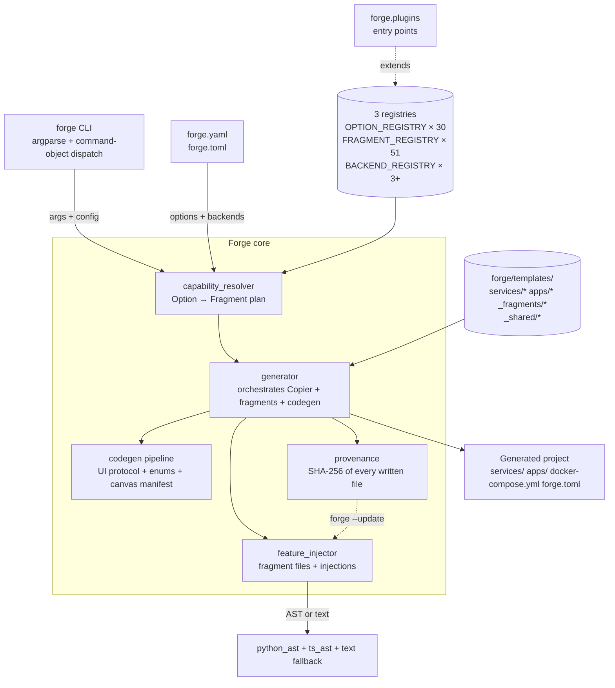
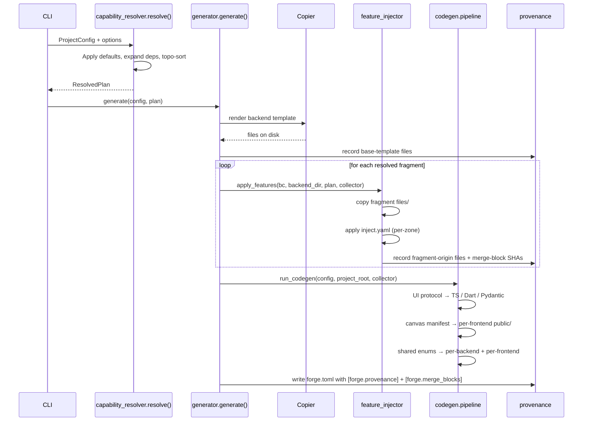

# forge architecture

This document describes forge's internal design — the registries, the fragment pipeline, the codegen layer, the injectors, and the published canvas packages. For "how do I use forge?" see `GETTING_STARTED.md`; for design decisions see `docs/architecture-decisions/ADR-*.md`.

## One-page overview



## The registry triad

Every configurable thing in forge lives in one of three registries populated at import time:

### `OPTION_REGISTRY` — `forge/options.py`

The **user-facing surface**. Each `Option` is a typed knob:

```python
Option(
    path="rag.backend",
    type=OptionType.ENUM,
    default="none",
    options=("none", "pgvector", "qdrant", "chroma", ...),
    category=FeatureCategory.KNOWLEDGE,
    enables={
        "qdrant": ("vector_store_port", "vector_store_qdrant"),
        "pgvector": ("vector_store_port", "vector_store_postgres"),
        ...
    },
)
```

- `path` is a dotted identifier; the CLI accepts `--set rag.backend=qdrant`, YAML accepts `options: { rag.backend: qdrant }`, JSON Schema export names it `rag.backend`.
- `type` drives validation and CLI parsing (`bool` / `enum` / `int` / `str` / `list`).
- `enables` maps chosen values to **Fragment names** (plumbing-level, not user-visible).

### `FRAGMENT_REGISTRY` — `forge/fragments.py`

The **implementation side**. Each `Fragment` names a capability and declares per-backend implementations:

```python
Fragment(
    name="vector_store_qdrant",
    depends_on=("vector_store_port",),
    capabilities=("qdrant",),
    implementations={
        BackendLanguage.PYTHON: FragmentImplSpec(
            fragment_dir="vector_store_qdrant/python",
            dependencies=("qdrant-client>=1.12.0",),
            env_vars=(("QDRANT_URL", "http://qdrant:6333"), ...),
        ),
    },
)
```

- `implementations` is keyed by `BackendLanguage` (Python/Node/Rust or a `_PluginLanguage` sentinel for plugin backends).
- `fragment_dir` is a path under `forge/templates/_fragments/` (or an absolute path for plugin-shipped fragments).
- `depends_on` + `conflicts_with` drive the resolver's topological sort + conflict detection.

### `BACKEND_REGISTRY` + `FRONTEND_SPECS` — `forge/config.py`

The **scaffolding side**. Maps each backend/frontend identifier to its Copier template directory and display metadata. Plugins can add new languages via `api.add_backend(value, spec)` / `api.add_frontend(value, spec)`; resolved via `resolve_backend_language` / `resolve_frontend_framework`.

## The generation pipeline



## Injector backends

File extension drives the injector backend. All share the same BEGIN/END sentinel-block format for idempotent re-application.

| Extension | Injector | Robustness |
|---|---|---|
| `.py` / `.pyi` | `forge/injectors/python_ast.py` | LibCST-anchored — survives Black / Ruff reformatting |
| `.ts` / `.tsx` / `.js` / `.jsx` / `.mjs` | `forge/injectors/ts_ast.py` (regex) or `ts_morph_sidecar.py` (`FORGE_TS_AST=1`) | Regex anchor comments; falls back to text markers |
| everything else | `_inject_snippet` (text-marker) | Line-based find + insert |

Each injection declares a **zone** (`generated` | `user` | `merge`):

- `generated` — always overwrites on re-apply
- `user` — emitted once, preserved on re-apply
- `merge` — three-way compare against the baseline SHA in `[forge.merge_blocks]`; writes `.forge-merge` sidecar on conflict

## Provenance + `forge --update`

Every file forge writes gets a row in `forge.toml` under `[forge.provenance]`:

```toml
[forge.provenance."services/api/src/app/main.py"]
origin = "base-template"
sha256 = "abc123..."

[forge.provenance."services/api/src/app/middleware/rate_limit.py"]
origin = "fragment"
sha256 = "def456..."
fragment_name = "rate_limit"
```

On `forge --update`, the updater:

1. Re-resolves the plan from `[forge.options]`.
2. Classifies each tracked file as `unchanged` / `user-modified` / `missing` using the recorded SHA.
3. Re-applies fragments under one of three update modes (CLI flag `--mode`, default `merge`):
   - `merge` — three-way decide via `forge.merge.file_three_way_decide` against the manifest baseline; emits `.forge-merge` (or `.forge-merge.bin`) sidecars on conflict and continues.
   - `skip` — pre-1.1 behaviour: pre-existing destinations preserved unconditionally.
   - `overwrite` — clobber pre-existing destinations with fragment content.
4. Injections run through zone semantics.
5. The `[forge.provenance]` + `[forge.merge_blocks]` tables are re-stamped.

Pre-1.1 projects with empty `[forge.provenance]` can adopt their current tree as the baseline via `forge --migrate-only adopt-baseline` — the codemod stamps every file under `services/` / `apps/` / `tests/` with `origin="base-template"` so future merges have something to compare against.

## Codegen layer

`forge/codegen/pipeline.py` runs after fragments and emits authoritative files from single-source-of-truth schemas:

| Source | Targets |
|---|---|
| `forge/templates/_shared/ui-protocol/*.schema.json` | TS types for Vue/Svelte, Dart for Flutter, Pydantic for Python backends |
| `forge/templates/_shared/canvas-components/*.props.schema.json` | `canvas.manifest.json` per frontend |
| `forge/templates/_shared/domain/enums/*.yaml` | Python IntEnum / TS literal / Zod / Rust serde / Dart enum |
| `forge/templates/_domain/*.yaml` (user) | SQLAlchemy + Pydantic / Prisma + Zod / sqlx structs + OpenAPI |
| `forge/templates/_domain/*.tsp` (user, via TypeSpec bridge) | OpenAPI 3.1 → same pipeline as YAML entities |

Domain emitters live in `forge/domain/emitters.py`. The TypeSpec bridge is `forge/domain/typespec.py` — opt-in via toolchain availability.

## Published canvas packages

Three npm/pub.dev packages ship the AG-UI streaming client + canvas components. Generated projects take them as peer dependencies.

```mermaid
flowchart LR
    subgraph forge_repo[forge monorepo]
        core[forge Python CLI] -->|PyPI| pypi[pypi.org]
        vue_pkg[@forge/canvas-vue] -->|npm| npm[npmjs.com]
        svelte_pkg[@forge/canvas-svelte] -->|npm| npm
        dart_pkg[forge_canvas] -->|pub.dev| pubdev[pub.dev]
    end

    subgraph generated[Generated project]
        gen_backend[services/api] -.-> pypi
        gen_vue[apps/web-vue] -.-> npm
        gen_svelte[apps/web-svelte] -.-> npm
        gen_flutter[apps/web-flutter] -.-> pubdev
    end
```

Components: `Report`, `CodeViewer`, `DataTable`, `DynamicForm`, `WorkflowDiagram`. Each ships with a JSON-Schema props declaration consumed by the runtime lint (`lintAndResolve`) in dev mode.

## Plugin architecture

Third parties extend forge via `importlib.metadata` entry points in the `forge.plugins` group:

```toml
[project.entry-points."forge.plugins"]
my_plugin = "my_plugin:register"
```

The `register(api: ForgeAPI)` callable is invoked at CLI startup. `ForgeAPI` exposes:

- `add_option(Option)` — new user-facing knob
- `add_fragment(Fragment)` — new fragment with per-backend implementations
- `add_backend(value, BackendSpec)` — new backend language (e.g. Go, Java)
- `add_frontend(value, FrontendSpec)` — new frontend framework (e.g. Solid, Qwik)
- `add_command(name, handler)` — new `forge --<name>` flag + handler
- `add_emitter(target, callable)` — new codegen target

Plugins can ship fragments from their own package tree — `fragment_dir` accepts absolute paths. See `docs/plugin-development.md` for the full walkthrough.

## Testing surface

| Layer | Test file pattern | Count |
|---|---|---|
| CLI parsing + dispatch | `test_cli_*.py` | ~180 |
| Options + fragments + resolver | `test_options.py`, `test_*_fragment*.py` | ~90 |
| Codegen (UI protocol, canvas, enums, domain) | `test_*_codegen.py`, `test_canvas_contract.py`, `test_domain_spec.py`, `test_openapi_contract.py` | ~70 |
| Injectors | `test_python_ast_injection.py`, `test_ts_ast_injection.py`, `test_three_way_merge.py` | ~30 |
| Provenance + updater + migrations | `test_provenance.py`, `test_migrations.py` | ~25 |
| Golden snapshots (shape) | `test_golden_snapshots.py` × 4 presets | 4 |
| MCP | `test_mcp_client.py`, `test_mcp_audit.py` | ~15 |
| E2E (behind `-m e2e`) | `tests/e2e/test_full_generation.py` | 3–5 |

Coverage floor: 75% (enforced in `pyproject.toml`). Mutation-test scoping: `forge/feature_injector.py`, `merge.py`, `provenance.py`, `injectors/*`, `updater.py`. See `docs/mutation-testing.md`.
