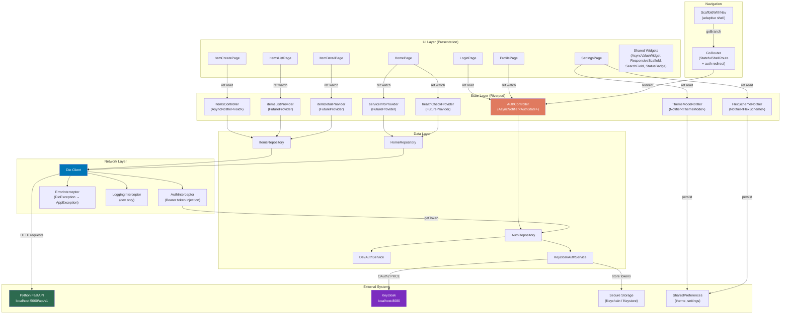

# Flutter Frontend

A production-grade cross-platform Flutter application template targeting **Web**, **Desktop** (Windows, macOS, Linux), and **Mobile** (Android, iOS). It integrates with a Python FastAPI backend via RESTful APIs and Keycloak for OAuth2 authentication.

## Table of Contents

- [Architecture Overview](#architecture-overview)
- [System Design Diagram](#system-design-diagram)
- [Directory Structure](#directory-structure)
- [Technology Stack](#technology-stack)
- [Features](#features)
- [Components](#components)
- [Getting Started](#getting-started)
- [Running the Application](#running-the-application)
- [Code Generation](#code-generation)
- [OpenAPI Client Generation](#openapi-client-generation)
- [Testing](#testing)
- [Configuration](#configuration)
- [Backend Integration](#backend-integration)

---

## Architecture Overview

The application follows a **Feature-First** architecture with clear separation of concerns across three layers:

| Layer | Responsibility | Key Patterns |
|-------|---------------|--------------|
| **Presentation** | UI rendering, user interaction | `HookConsumerWidget`, `ConsumerWidget`, Material 3 |
| **State** | Application state, server state caching, navigation guards | Riverpod `AsyncNotifier`, `Notifier`, `FutureProvider` |
| **Data** | API communication, local persistence, authentication | Repository pattern, Dio HTTP client, `SharedPreferences` |

**Key principles:**
- **Feature-first organization** -- each feature (`auth`, `home`, `items`, `profile`, `settings`) is a self-contained module with its own `data/`, `domain/`, and `presentation/` layers.
- **Riverpod for all shared state** -- server data, auth session, persisted settings, and derived state.
- **flutter_hooks for ephemeral state** -- `TextEditingController`, `FocusNode`, debounce timers, and animations scoped to widget lifecycle.
- **Typed error handling** -- a sealed `AppException` hierarchy maps HTTP errors to user-facing messages.
- **Adaptive layout** -- a custom `ResponsiveScaffold` switches between `NavigationBar` (mobile), `NavigationRail` (tablet), and extended rail (desktop) based on screen width.

---

## System Design Diagram



### Data Flow

**Read flow** (e.g., listing items):
```
ItemsListPage → ref.watch(itemsListProvider) → ItemsRepository.listItems()
    → Dio.get('/items') → AuthInterceptor adds Bearer token
    → ErrorInterceptor maps errors → PaginatedResponse<Item> returned
    → Riverpod caches as AsyncData → UI renders via AsyncValueWidget
```

**Mutation flow** (e.g., creating an item):
```
ItemForm.onSubmit() → ref.read(itemsControllerProvider.notifier).createItem()
    → ItemsRepository.createItem() → Dio.post('/items')
    → On success: ref.invalidate(itemsListProvider) → list auto-refetches
    → GoRouter.pop() → back to list
```

**Auth flow**:
```
App start → AuthController.build() → AuthRepository.init()
    → Dev mode: return hardcoded dev user
    → Production: flutter_appauth PKCE → Keycloak → JWT tokens
    → GoRouter redirect: unauthenticated → /login, authenticated → /
```

---

## Directory Structure

```
flutter_frontend/
├── analysis_options.yaml          # Strict lints + custom_lint + riverpod_lint
├── build.yaml                     # Code gen config (freezed, riverpod, go_router)
├── pubspec.yaml                   # Dependencies
├── scripts/
│   └── generate_api.sh            # OpenAPI client generation script
├── web/
│   ├── index.html
│   └── silent-check-sso.html      # Keycloak silent SSO iframe
├── lib/
│   ├── main.dart                  # Entry point
│   ├── bootstrap.dart             # ProviderScope + SharedPreferences init
│   └── src/
│       ├── app.dart               # MaterialApp.router (theme + GoRouter)
│       │
│       ├── core/                  # Cross-cutting concerns
│       │   ├── config/
│       │   │   └── env_config.dart          # --dart-define environment config
│       │   ├── constants/
│       │   │   ├── api_constants.dart       # API path segments
│       │   │   └── app_sizes.dart           # Breakpoints, spacing, radii
│       │   ├── errors/
│       │   │   ├── app_exception.dart       # Sealed freezed exception hierarchy
│       │   │   └── error_formatters.dart    # Exception → user-facing String
│       │   ├── extensions/
│       │   │   └── async_value_extensions.dart
│       │   └── storage/
│       │       ├── key_value_storage.dart    # SharedPreferences provider
│       │       └── secure_storage_provider.dart  # FlutterSecureStorage provider
│       │
│       ├── api/                   # Network layer
│       │   ├── client/
│       │   │   ├── dio_client.dart           # Dio provider + interceptor chain
│       │   │   ├── auth_interceptor.dart     # Bearer token injection
│       │   │   ├── error_interceptor.dart    # HTTP status → AppException
│       │   │   └── logging_interceptor.dart  # Dev-only request/response logs
│       │   ├── models/
│       │   │   ├── api_error.dart            # API error response model
│       │   │   └── paginated_response.dart   # Generic PaginatedResponse<T>
│       │   └── generated/                    # OpenAPI generated client (gitignored)
│       │
│       ├── routing/               # Navigation
│       │   ├── app_router.dart              # GoRouter with auth redirect
│       │   ├── route_names.dart             # Route name constants
│       │   └── scaffold_with_nav.dart       # StatefulShellRoute → ResponsiveScaffold
│       │
│       ├── theme/                 # Theming
│       │   ├── app_theme.dart               # FlexThemeData.light/dark builders
│       │   └── theme_provider.dart          # ThemeMode + FlexScheme notifiers
│       │
│       ├── shared/                # Reusable components
│       │   ├── providers/
│       │   │   └── current_user_provider.dart  # Derived User from auth state
│       │   └── widgets/
│       │       ├── async_value_widget.dart      # Generic loading/error/data
│       │       ├── confirm_dialog.dart          # Confirmation dialog
│       │       ├── empty_state_widget.dart      # Empty list placeholder
│       │       ├── error_display_widget.dart    # Error with retry
│       │       ├── responsive_scaffold.dart     # Adaptive nav layout
│       │       ├── search_field.dart            # Debounced search input
│       │       └── status_badge.dart            # Item status chip
│       │
│       └── features/              # Feature modules
│           ├── auth/
│           │   ├── data/
│           │   │   ├── auth_repository.dart      # Auth orchestrator
│           │   │   ├── dev_auth_service.dart      # Mock auth (dev mode)
│           │   │   ├── jwt_decoder.dart           # JWT payload parser
│           │   │   └── keycloak_auth_service.dart # OAuth2 PKCE via flutter_appauth
│           │   ├── domain/
│           │   │   ├── auth_state.dart            # Authenticated / Unauthenticated
│           │   │   ├── token_pair.dart            # Access + refresh tokens
│           │   │   └── user_model.dart            # User from JWT claims
│           │   └── presentation/
│           │       ├── auth_controller.dart       # AsyncNotifier<AuthState>
│           │       └── login_page.dart            # Sign-in screen
│           │
│           ├── home/
│           │   ├── data/
│           │   │   └── home_repository.dart       # /, /info, /health/ready
│           │   ├── domain/
│           │   │   ├── health_model.dart          # Readiness/liveness models
│           │   │   └── info_model.dart            # Service info model
│           │   └── presentation/
│           │       ├── home_page.dart             # Dashboard
│           │       └── widgets/
│           │           ├── health_status_card.dart
│           │           ├── info_card.dart
│           │           └── quick_actions_card.dart
│           │
│           ├── items/
│           │   ├── data/
│           │   │   └── items_repository.dart      # CRUD + pagination via Dio
│           │   ├── domain/
│           │   │   ├── item_model.dart            # Item, ItemCreate, ItemUpdate
│           │   │   ├── item_status.dart           # Draft / Active / Archived enum
│           │   │   └── items_query_params.dart    # Pagination + filter params
│           │   └── presentation/
│           │       ├── item_create_page.dart
│           │       ├── item_detail_page.dart      # View / edit / delete
│           │       ├── items_controller.dart      # List + mutation notifiers
│           │       ├── items_list_page.dart        # Search, filter, paginated list
│           │       └── widgets/
│           │           ├── item_card.dart
│           │           ├── item_form.dart          # HookConsumerWidget form
│           │           └── item_status_filter.dart
│           │
│           ├── profile/
│           │   └── presentation/
│           │       └── profile_page.dart          # User info from JWT
│           │
│           └── settings/
│               ├── domain/
│               │   └── settings_model.dart        # SettingsState (freezed)
│               └── presentation/
│                   ├── settings_page.dart
│                   └── widgets/
│                       ├── color_scheme_picker.dart  # 20 FlexScheme presets
│                       └── theme_mode_selector.dart  # Light / System / Dark
│
├── test/
│   ├── fixtures/                  # Test data
│   │   ├── items.dart
│   │   └── user.dart
│   ├── helpers/                   # Test utilities
│   │   ├── mocks.dart             # mocktail Mock classes
│   │   └── test_helpers.dart      # ProviderScope wrapper
│   └── src/
│       ├── features/
│       │   ├── auth/
│       │   │   └── auth_controller_test.dart     # 4 tests
│       │   └── items/
│       │       └── items_repository_test.dart     # 5 tests
│       └── shared/
│           └── widgets/
│               └── async_value_widget_test.dart   # 4 tests
│
└── integration_test/
    └── (future: full app flow tests)
```

---

## Technology Stack

| Category | Technology | Purpose |
|----------|-----------|---------|
| **Framework** | Flutter 3.41+ / Dart 3.10+ | Cross-platform UI |
| **State Management** | Riverpod 2.6 (`@riverpod` codegen) | Global state, DI, server state caching |
| **Ephemeral State** | flutter_hooks (`HookConsumerWidget`) | Widget-scoped controllers, animations |
| **Networking** | Dio 5.x | HTTP client with interceptor pipeline |
| **Routing** | go_router 14.x | Declarative routing, `StatefulShellRoute`, auth guards |
| **Theming** | flex_color_scheme 8.x | Material 3 theming with 60+ preset color schemes |
| **Auth** | flutter_appauth 8.x | OAuth2 PKCE flow for Keycloak |
| **Serialization** | freezed 3.x + json_serializable | Immutable models, JSON (de)serialization |
| **Storage** | shared_preferences, flutter_secure_storage | Settings persistence, token storage |
| **Linting** | custom_lint + riverpod_lint | Architectural rule enforcement |
| **Testing** | flutter_test + mocktail | Unit, widget, and provider tests |
| **Code Gen** | build_runner | Generates `.freezed.dart`, `.g.dart`, riverpod/router code |

---

## Features

### Authentication
- **OAuth2 PKCE** via Keycloak (mobile/desktop uses `flutter_appauth`, web uses browser redirect)
- **Dev mode** (`AUTH_DISABLED=true`): auto-authenticates with a hardcoded dev user, no Keycloak needed
- **Token management**: secure storage on mobile/desktop, auto-refresh before expiry
- **Route guards**: unauthenticated users are redirected to `/login`

### Adaptive Layout
- **Compact** (< 600px): bottom `NavigationBar` -- optimized for phones
- **Medium** (600-1200px): side `NavigationRail` with icons + selected label -- tablets
- **Expanded** (> 1200px): extended `NavigationRail` with all labels + branding -- desktop/web
- Seamless transitions as the window resizes

### Home Dashboard
- **Service info card**: displays backend title, version, and description from `GET /info`
- **Health status card**: real-time readiness probe from `GET /health/ready` with per-component status indicators and latency
- **Quick actions**: navigation chips to Items, Create Item, Profile, Settings

### Items Management (Full CRUD)
- **List**: paginated items with "Load More", pull-to-refresh
- **Search**: debounced text search (400ms) filtering by name/description
- **Filter**: segmented button filter by status (All / Draft / Active / Archived)
- **Create**: form with name, description, comma-separated tags, status dropdown
- **Detail view**: full item display with metadata (ID, timestamps)
- **Edit**: inline edit toggling the detail page to form mode
- **Delete**: confirmation dialog before deletion

### Profile
- Displays user info extracted from the JWT token (name, email, username, roles, customer ID)
- Sign-out button

### Settings
- **Theme mode**: Light / System / Dark toggle (persisted)
- **Color scheme**: grid picker with 20 `FlexScheme` presets (persisted)
- Changes apply immediately across the entire app

---

## Components

### Core Components

| Component | File | Description |
|-----------|------|-------------|
| `EnvConfig` | `core/config/env_config.dart` | Reads `--dart-define` compile-time variables for API URL, auth flags, Keycloak settings |
| `AppException` | `core/errors/app_exception.dart` | Sealed freezed hierarchy: `ServerException`, `NetworkException`, `UnauthorizedException`, `NotFoundException`, `ConflictException`, `ValidationException` |
| `AppSizes` | `core/constants/app_sizes.dart` | Responsive breakpoints (600/840/1200px), spacing scale, border radii |

### Network Components

| Component | File | Description |
|-----------|------|-------------|
| `Dio` provider | `api/client/dio_client.dart` | Configured Dio instance with base URL, timeouts, interceptor chain |
| `RestClient` provider | `api/client/rest_client_provider.dart` | Riverpod provider exposing the generated `RestClient` (wraps Dio with tag-grouped sub-clients) |
| `AuthInterceptor` | `api/client/auth_interceptor.dart` | Injects `Authorization: Bearer <token>` header from auth repository |
| `ErrorInterceptor` | `api/client/error_interceptor.dart` | Maps HTTP status codes to typed `AppException` variants (uses generated `ErrorResponse` model) |
| Generated clients | `api/generated/{tag}/{tag}_client.dart` | Retrofit-based API clients per OpenAPI tag: `HomeClient`, `HealthClient`, `ItemsClient`, `TasksClient` |
| Generated models | `api/generated/models/*.dart` | `json_serializable` data classes: `Item`, `ItemCreate`, `ItemUpdate`, `PaginatedItemsResult`, `ErrorResponse`, etc. |

### Shared Widgets

| Widget | File | Description |
|--------|------|-------------|
| `AsyncValueWidget<T>` | `shared/widgets/async_value_widget.dart` | Generic handler for Riverpod's `AsyncValue` -- renders loading spinner, error display, or data widget |
| `ResponsiveScaffold` | `shared/widgets/responsive_scaffold.dart` | Adaptive layout switching between `NavigationBar` / `NavigationRail` based on screen width |
| `SearchField` | `shared/widgets/search_field.dart` | `TextField` with configurable debounce, clear button, search icon |
| `StatusBadge` | `shared/widgets/status_badge.dart` | Colored chip for item status (Draft=orange, Active=green, Archived=grey) |
| `EmptyStateWidget` | `shared/widgets/empty_state_widget.dart` | Centered icon + message for empty lists |
| `ErrorDisplayWidget` | `shared/widgets/error_display_widget.dart` | Error message with optional retry button |
| `showConfirmDialog` | `shared/widgets/confirm_dialog.dart` | Reusable confirmation dialog with destructive mode styling |

---

## Getting Started

### Prerequisites

- **Flutter SDK** >= 3.29.0 (tested with 3.41.3)
- **Dart SDK** >= 3.10.4
- For Keycloak auth (production): Keycloak server running on `localhost:8080`
- For API integration: Python backend running on `localhost:5000`

### Install Dependencies

```bash
cd flutter_frontend
flutter pub get
```

### Generate Code

All freezed models, Riverpod providers, and go_router routes require code generation:

```bash
dart run build_runner build --delete-conflicting-outputs
```

For continuous generation during development:

```bash
dart run build_runner watch --delete-conflicting-outputs
```

---

## Running the Application

### Development Mode (No Keycloak Required)

```bash
flutter run \
  --dart-define=AUTH_DISABLED=true \
  --dart-define=API_BASE_URL=http://localhost:5000/api/v1
```

This auto-authenticates with a dev user (`dev@localhost`, roles: `admin`, `user`).

### Production Mode (Keycloak Auth)

```bash
flutter run \
  --dart-define=AUTH_DISABLED=false \
  --dart-define=API_BASE_URL=https://your-api.example.com/api/v1 \
  --dart-define=KEYCLOAK_URL=https://your-keycloak.example.com \
  --dart-define=KEYCLOAK_REALM=master \
  --dart-define=KEYCLOAK_CLIENT_ID=my-service
```

### Platform-Specific

```bash
# Web
flutter run -d chrome \
  --dart-define=AUTH_DISABLED=true \
  --dart-define=API_BASE_URL=http://localhost:5000/api/v1

# Windows desktop
flutter run -d windows \
  --dart-define=AUTH_DISABLED=true \
  --dart-define=API_BASE_URL=http://localhost:5000/api/v1

# Build web release
flutter build web \
  --dart-define=AUTH_DISABLED=false \
  --dart-define=API_BASE_URL=https://api.example.com/api/v1
```

### Environment Variables

| Variable | Default | Description |
|----------|---------|-------------|
| `API_BASE_URL` | `http://localhost:5000/api/v1` | Backend API base URL |
| `AUTH_DISABLED` | `true` | Set `false` for Keycloak authentication |
| `KEYCLOAK_URL` | `http://localhost:8080` | Keycloak server URL |
| `KEYCLOAK_REALM` | `master` | Keycloak realm |
| `KEYCLOAK_CLIENT_ID` | `my-service` | OAuth2 client ID |

All variables are passed via `--dart-define` at compile time.

---

## Code Generation

This project uses `build_runner` for code generation with:

| Generator | Annotation | Output | Purpose |
|-----------|-----------|--------|---------|
| `freezed` | `@freezed` | `*.freezed.dart` | Immutable data classes with `copyWith`, `==`, `toString` (app-only models) |
| `json_serializable` | `@JsonSerializable` | `*.g.dart` | JSON `fromJson` / `toJson` for both hand-written and swagger_parser-generated models |
| `retrofit_generator` | `@RestApi` | `*.g.dart` | Concrete Dio client implementations from swagger_parser-generated abstract clients |
| `riverpod_generator` | `@riverpod`, `@Riverpod` | `*.g.dart` | Typed Riverpod providers from annotated functions/classes |
| `go_router_builder` | `@TypedGoRoute` | `*.g.dart` | Type-safe route definitions (available for future use) |

### Workflow

```bash
# One-time build
dart run build_runner build --delete-conflicting-outputs

# Watch mode (rebuilds on file changes)
dart run build_runner watch --delete-conflicting-outputs

# Clean generated files
dart run build_runner clean
```

---

## OpenAPI Client Generation (swagger_parser)

API models and Retrofit clients are generated from the committed OpenAPI spec using [swagger_parser](https://pub.dev/packages/swagger_parser).

### How It Works

1. The OpenAPI spec lives at `openapi/openapi.json` (committed to git)
2. `swagger_parser` reads `swagger_parser.yaml` and generates source files into `lib/src/api/generated/`
3. `build_runner` then generates the `.g.dart` files (json_serializable + retrofit) from those source files
4. Feature repositories wrap the generated clients with Riverpod providers

### Configuration (`swagger_parser.yaml`)

| Option | Value | Purpose |
|--------|-------|---------|
| `client_type` | `dio` | Generates Retrofit abstract clients using Dio |
| `json_serializable` | `true` | Models use `@JsonSerializable` for JSON handling |
| `put_in_folder` | `true` | Organizes clients by OpenAPI tag (Home, Health, Items, Tasks) |
| `squish_clients` | `true` | One client class per tag, not per endpoint |
| `enums_to_json` | `true` | Enums get `toJson()` / `fromJson()` methods |
| `unknown_enum_value` | `true` | Adds `$unknown` fallback for forward compatibility |
| `mark_files_as_generated` | `true` | Adds `// GENERATED CODE` headers |

### Generated Output

```
lib/src/api/generated/
├── export.dart                    # Barrel file re-exporting everything
├── rest_client.dart               # Root client with .home, .health, .items, .tasks accessors
├── home/home_client.dart          # HomeClient: getStatus(), getInfo()
├── health/health_client.dart      # HealthClient: livenessCheck(), readinessCheck()
├── items/items_client.dart        # ItemsClient: listItems(), createItem(), getItem(), updateItem(), deleteItem()
├── tasks/tasks_client.dart        # TasksClient: enqueueTask(), getTaskStatus(), cancelTask()
└── models/
    ├── item.dart                  # Item data class
    ├── item_create.dart           # ItemCreate request body
    ├── item_update.dart           # ItemUpdate request body
    ├── item_status.dart           # ItemStatus enum (DRAFT, ACTIVE, ARCHIVED)
    ├── paginated_items_result.dart # Paginated list response
    ├── error_response.dart        # API error response
    ├── error_detail.dart          # Error detail with code + errors
    ├── info_response.dart         # Service info
    ├── status_response.dart       # Status check
    ├── liveness_response.dart     # Health liveness
    ├── readiness_response.dart    # Health readiness
    ├── health_component.dart      # Per-component health
    ├── task_enqueue_request.dart   # Task creation
    ├── task_enqueue_response.dart  # Task creation response
    ├── task_status.dart           # TaskStatus enum
    └── task_status_response.dart  # Task status detail
```

### Workflow

```bash
# Regenerate from committed spec (no backend required)
bash scripts/generate_api.sh

# Fetch latest spec from running backend, then regenerate
bash scripts/generate_api.sh --fetch

# Or run each step manually:
dart run swagger_parser                           # Generate source files
dart run build_runner build --delete-conflicting-outputs  # Generate .g.dart files
```

### Updating the API Spec

When the backend API changes:

```bash
# 1. Fetch the latest spec (backend must be running on port 5000)
bash scripts/fetch_openapi.sh

# 2. Regenerate client code
bash scripts/generate_api.sh

# 3. Commit both the updated spec and generated source files
```

The `openapi/openapi.json` spec is committed so the project builds without the backend running. The generated `.g.dart` files are gitignored since they're reproducible via `build_runner`.

---

## Testing

### Run All Tests

```bash
flutter test
```

### Test Structure

```
test/
├── fixtures/           # Shared test data (items, users)
├── helpers/            # Test utilities (mocks, ProviderScope wrapper)
└── src/
    ├── features/
    │   ├── auth/       # AuthController state transitions (4 tests)
    │   └── items/      # ItemsRepository CRUD operations (5 tests)
    └── shared/
        └── widgets/    # AsyncValueWidget rendering states (4 tests)
```

### Test Categories

| Category | Pattern | What's Tested |
|----------|---------|---------------|
| **Unit** | `*_test.dart` in `features/*/` | Repositories (mock Dio), controllers (ProviderContainer with overrides) |
| **Widget** | `*_test.dart` in `shared/widgets/` | Widget rendering for loading/data/error states |
| **Integration** | `integration_test/` | Full app flow (future) |

### Testing Patterns

**Repository tests** mock `Dio` via `mocktail`:
```dart
final mockDio = MockDio();
final repo = ItemsRepository(dio: mockDio);
when(() => mockDio.get(any(), queryParameters: any(named: 'queryParameters')))
    .thenAnswer((_) async => Response(data: fixture, ...));
```

**Controller tests** use `ProviderContainer` with overrides:
```dart
final container = ProviderContainer(overrides: [
  authRepositoryProvider.overrideWithValue(mockAuthRepo),
]);
await container.read(authControllerProvider.notifier).login();
expect(container.read(authControllerProvider).value, isA<Authenticated>());
```

---

## Configuration

### Analysis Options (`analysis_options.yaml`)

Extends `package:flutter_lints` with:
- `custom_lint` plugin for custom rules
- `riverpod_lint` for Riverpod-specific checks
- Excludes generated files (`*.g.dart`, `*.freezed.dart`)
- Enforces `prefer_const_constructors`, `avoid_print`, `prefer_single_quotes`, `require_trailing_commas`

### Build Configuration (`build.yaml`)

- `json_serializable`: `field_rename: snake` (maps Dart camelCase to API snake_case)
- `explicit_to_json: true` for nested model serialization
- All generators scoped to `lib/src/**/*.dart`, excluding `api/generated/`

---

## Backend Integration

### Python FastAPI Backend

The Flutter app integrates with the backend at `python_service/`:

| Flutter Feature | Backend Endpoint | Method | Auth Required |
|----------------|-----------------|--------|---------------|
| Home - status | `GET /` | GET | No |
| Home - info | `GET /info` | GET | No |
| Home - health | `GET /health/ready` | GET | No |
| Items - list | `GET /items?skip=0&limit=50&status=ACTIVE&search=query` | GET | Yes |
| Items - create | `POST /items` | POST | Yes |
| Items - detail | `GET /items/{id}` | GET | Yes |
| Items - update | `PATCH /items/{id}` | PATCH | Yes |
| Items - delete | `DELETE /items/{id}` | DELETE | Yes |

### API Error Handling

The `ErrorInterceptor` maps backend error responses to typed exceptions:

| HTTP Status | AppException | UI Behavior |
|-------------|-------------|-------------|
| 401 | `UnauthorizedException` | Redirect to login |
| 404 | `NotFoundException` | "Resource not found" message |
| 409 | `ConflictException` | "Already exists" message |
| 422 | `ValidationException` | Shows validation errors list |
| 5xx | `ServerException` | Generic server error message |
| Timeout/Network | `NetworkException` | "Check your connection" message |

### Multi-Tenancy

The backend automatically scopes data by `customer_id` from the JWT token. The Flutter app passes the Bearer token on all protected requests via the `AuthInterceptor`, and the backend handles tenant isolation transparently.

### CORS

For local development, either:
1. Enable CORS on the backend: set `APP__SERVER__CORS__ENABLED=true` in the Python service
2. Or use the backend's proxy configuration

---

## License

MIT
