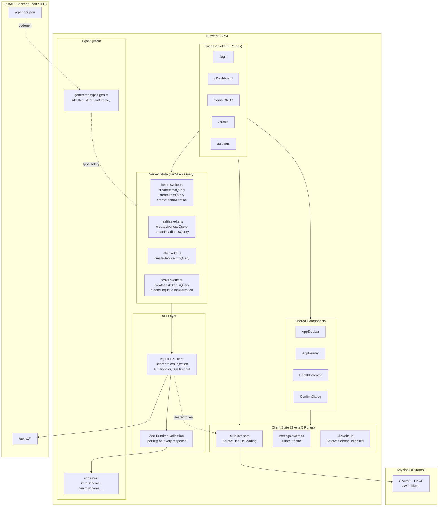
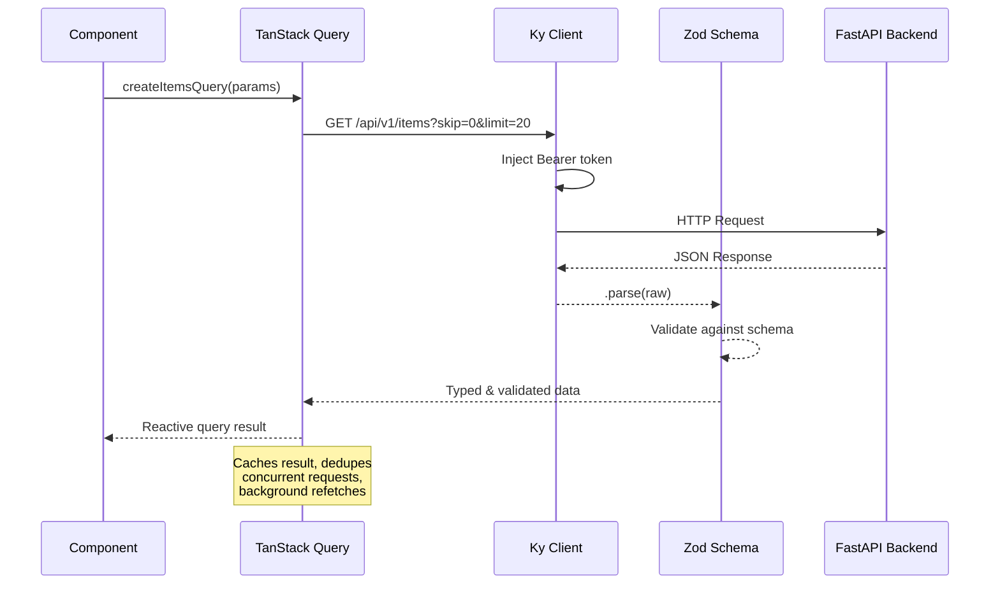
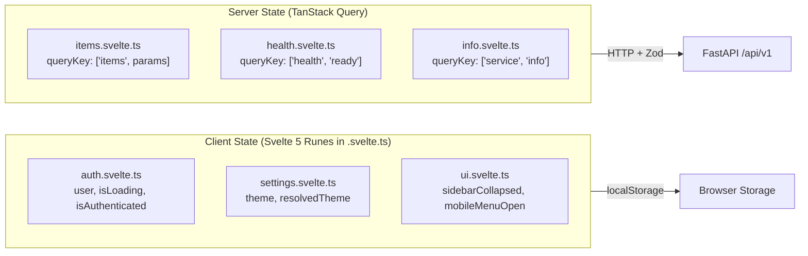

# Svelte Frontend

A modern **Svelte 5 Single Page Application** built with SvelteKit, TanStack Query, Ky, and Zod. Designed as a production-ready frontend template that integrates with a FastAPI backend via OpenAPI.

## System Design



### Data Flow



## Tech Stack

| Layer | Technology | Purpose |
|-------|-----------|---------|
| **Framework** | SvelteKit + adapter-static | SPA routing and build |
| **Reactivity** | Svelte 5 Runes | `$state`, `$derived`, `$effect` |
| **Server State** | TanStack Svelte Query v5 | Caching, deduplication, background refetch |
| **HTTP Client** | Ky | Lightweight fetch wrapper with hooks |
| **Validation** | Zod | Runtime response validation |
| **Type Generation** | Hey API (openapi-ts) | OpenAPI to TypeScript types |
| **Styling** | Tailwind CSS v4 | Utility-first CSS |
| **Icons** | Lucide Svelte | Consistent icon set |
| **Auth** | Keycloak JS | OAuth2 + PKCE authentication |
| **Notifications** | Svelte Sonner | Toast notifications |
| **Unit Testing** | Vitest + MSW | Fast unit tests with API mocking |
| **E2E Testing** | Playwright | Browser-based integration tests |

## Directory Structure

```
svelte_frontend/
├── .env.development              # Dev environment variables
├── .gitignore
├── eslint.config.js              # ESLint flat config (Svelte + TypeScript)
├── openapi-ts.config.ts          # Hey API codegen configuration
├── openapi-snapshot.json         # OpenAPI spec snapshot for codegen
├── package.json                  # Dependencies and scripts
├── playwright.config.ts          # E2E test configuration
├── svelte.config.js              # SvelteKit: adapter-static, path aliases
├── tsconfig.json                 # Strict TypeScript configuration
├── vite.config.ts                # Vite: plugins, proxy, test config
│
├── static/
│   └── silent-check-sso.html     # Keycloak silent SSO check endpoint
│
├── src/
│   ├── app.css                   # Tailwind v4 imports + shadcn theme variables
│   ├── app.d.ts                  # Global type declarations (ImportMetaEnv)
│   ├── app.html                  # HTML shell template
│   │
│   ├── api/                      # API integration layer
│   │   ├── client.ts             # Ky HTTP client (singleton, auth hooks)
│   │   ├── namespace.ts          # Re-exports types as API.* namespace
│   │   ├── generated/
│   │   │   └── types.gen.ts      # OpenAPI-generated TypeScript interfaces
│   │   └── schemas/
│   │       ├── index.ts          # Barrel export
│   │       ├── common.schema.ts  # paginatedResponseSchema, apiErrorSchema
│   │       ├── item.schema.ts    # itemSchema, paginatedItemResponseSchema
│   │       ├── health.schema.ts  # livenessResponseSchema, readinessResponseSchema
│   │       └── task.schema.ts    # taskEnqueueResponseSchema, taskStatusResponseSchema
│   │
│   ├── lib/                      # Shared library code
│   │   ├── utils.ts              # cn() - Tailwind class merge utility
│   │   ├── auth/
│   │   │   └── auth.svelte.ts    # Keycloak auth module (Svelte 5 Runes)
│   │   ├── stores/
│   │   │   ├── settings.svelte.ts  # Theme store (dark/light/system)
│   │   │   ├── ui.svelte.ts        # UI state (sidebar, chat panel)
│   │   │   └── chat.svelte.ts      # AI chat message store
│   │   └── api/
│   │       ├── items.svelte.ts   # Item queries and mutations
│   │       ├── health.svelte.ts  # Health check queries
│   │       ├── info.svelte.ts    # Service info query
│   │       └── tasks.svelte.ts   # Background task queries/mutations
│   │
│   ├── components/               # Reusable UI components
│   │   ├── AppSidebar.svelte     # Collapsible sidebar with profile popover
│   │   ├── AppHeader.svelte      # Breadcrumbs + AI button + theme switcher
│   │   ├── AiChat.svelte         # AI chat panel (slide-in from right)
│   │   ├── AiChatInput.svelte    # Chat input with glow effect
│   │   ├── AiChatMessage.svelte  # Chat message bubble
│   │   ├── HealthIndicator.svelte  # Health status badge
│   │   └── ConfirmDialog.svelte  # Reusable confirmation modal
│   │
│   ├── routes/                   # SvelteKit file-based routing
│   │   ├── +layout.ts           # SSR=false, prerender=false (SPA mode)
│   │   ├── +layout.svelte       # Root: QueryClient, auth init, theme init
│   │   ├── +error.svelte        # Error/404 page
│   │   ├── login/
│   │   │   └── +page.svelte     # Login page
│   │   └── (app)/               # Auth-protected route group
│   │       ├── +layout.svelte   # Auth guard + sidebar/header layout
│   │       ├── +page.svelte     # Dashboard (home)
│   │       ├── profile/
│   │       │   └── +page.svelte # User profile
│   │       ├── settings/
│   │       │   └── +page.svelte # App settings
│   │       └── items/
│   │           ├── +page.svelte     # Items list
│   │           ├── new/
│   │           │   └── +page.svelte # Create item
│   │           └── [id]/
│   │               └── +page.svelte # Item detail/edit
│   │
│   └── test/                     # Test utilities
│       ├── setup.ts              # Vitest setup (MSW lifecycle)
│       └── mocks/
│           └── handlers.ts       # MSW request handlers
│
├── tests/                        # Playwright E2E tests
│   └── home.test.ts
│
└── build/                        # Production output (adapter-static)
    ├── index.html                # SPA entry point
    └── _app/                     # Hashed static assets
```

## Features

### AI Chat Panel

A slide-in AI assistant panel accessible from any page.

- **Trigger**: Click the "Ask AI" gradient pill button in the header, or press `Ctrl+J` / `Cmd+J`
- **Animation**: Panel slides in from the right edge with a smooth 300ms transition
- **Split Focus**: The working area compresses to accommodate the chat panel side-by-side
- **Chat UI**: Message bubbles with avatars, auto-scroll, typing indicator with bouncing dots
- **Input**: Auto-resizing textarea, Enter to send, Shift+Enter for newline
- **Glow Effect**: Input container pulses with an iridescent glow while the AI generates a response
- **Placeholder Buttons**: Attachment (Paperclip) and voice (Mic) buttons present but disabled
- **Context Badge**: Shows the current conversation context
- **Escape to Close**: Press Escape or click the X button to dismiss the panel
- **Resizable**: Chat width persisted to localStorage (400-600px range)

### Design System

OLED-optimized dark mode with AI-specific design tokens:

| Token | Light | Dark | Purpose |
|-------|-------|------|---------|
| `--ai-accent` | Purple (260, 60%, 55%) | Purple (260, 70%, 60%) | AI element primary color |
| `--ai-surface` | Light purple tint | Dark purple tint | AI message backgrounds |
| `--ai-border` | Soft purple | Dark purple | AI element borders |
| `--ai-glow` | Bright purple | Deep purple | Glow animation color |
| `--ai-gradient-*` | Purple → Cyan | Purple → Cyan | Gradient for AI button |

**Micro-interactions**:
- `btn-press`: Buttons scale to 0.98 on click for tactile feedback
- `ai-sparkle`: Subtle shimmer animation on the AI button icon
- `ai-glow-pulse`: Pulsing glow on the chat input during AI generation

**Accessibility**: All animations respect `prefers-reduced-motion` and fall back to instant transitions.

### Authentication

OAuth2 integration via **Keycloak** with PKCE flow and silent SSO.

- **Production**: Full Keycloak login with JWT token management
- **Development**: Auth disabled via `VITE_AUTH_DISABLED=true` (uses a hardcoded dev user)
- Auto-refresh tokens 30 seconds before expiry
- Route guards via `$effect()` in the `(app)` layout group
- 401 responses automatically trigger logout

```
┌─────────────┐     ┌──────────────┐     ┌──────────────┐
│  Login Page  │────>│   Keycloak   │────>│  Dashboard   │
│             │     │  OAuth2+PKCE │     │  (protected) │
└─────────────┘     └──────────────┘     └──────────────┘
        │                                       │
        │  VITE_AUTH_DISABLED=true               │
        └───> Dev User (skip Keycloak) ─────────┘
```

### Theme System

Three-mode theme with system preference detection:

| Mode | Behavior |
|------|----------|
| **Light** | Forces light theme |
| **Dark** | Forces dark theme |
| **System** | Follows OS preference, listens for changes |

- Persisted to `localStorage`
- Applied via Tailwind's `class` dark mode strategy
- Accessible from header dropdown and settings page

### Dashboard

Real-time service monitoring:

- **Service Info** -- Name, version, description from `/api/v1/info`
- **Health Status** -- Liveness and readiness from `/api/v1/health/*` (auto-refresh every 30s)
- **Component Health** -- Per-dependency status with latency metrics
- **System Info** -- Python version, platform details
- **Quick Actions** -- Navigation shortcuts

### Items CRUD

Full create-read-update-delete workflow:

| Operation | API Endpoint | UI Element |
|-----------|-------------|------------|
| **List** | `GET /api/v1/items` | Paginated table with search and status filter |
| **Create** | `POST /api/v1/items` | Form with name, description, status, tags |
| **View** | `GET /api/v1/items/{id}` | Detail card with all fields |
| **Edit** | `PATCH /api/v1/items/{id}` | Inline edit mode on detail page |
| **Delete** | `DELETE /api/v1/items/{id}` | Confirmation dialog |

Features:
- Debounced search (300ms delay)
- Status filter (Draft / Active / Archived)
- Paginated navigation with page size of 20
- Row click navigation to detail
- Per-row action dropdown (View, Delete)
- Optimistic cache invalidation on mutations
- Loading skeletons and error states

### Profile

Displays user information extracted from the JWT token:

- Avatar with initials
- Username, email, user ID, customer ID, organization
- Role badges
- Read-only (data comes from the auth provider)

### Settings

Application preferences:

- **Appearance** -- Theme toggle (Light / Dark / System)
- **Notifications** -- Placeholder for future settings
- **About** -- Application name, version, framework info

### Layout

Three-panel architecture with collapsible sidebar and slide-in AI chat:

```
┌──────────────────────────────────────────────────────────┐
│ Sidebar │ Header (Breadcrumbs)         [Ask AI] [Theme]  │
│ ┌─────┐ │────────────────────────────────────────────────│
│ │ Logo│ │                              │                 │
│ └─────┘ │                              │   AI Chat       │
│         │     Working Area             │   ┌───────────┐ │
│  Home   │     (routed pages)           │   │ Messages  │ │
│  Proj   │                              │   │           │ │
│         │                              │   │           │ │
│─────────│                              │   ├───────────┤ │
│ ⚙ Set  │                              │   │ Input     │ │
│ 👤 User │                              │   └───────────┘ │
└──────────────────────────────────────────────────────────┘
```

- **Sidebar**: Logo at top, primary nav in middle, Settings + Profile popover at bottom
- **Profile popover**: Click avatar for Account Settings, Billing, Preferences, Log Out
- **Collapsible**: 256px expanded, 56px collapsed, state persisted in localStorage
- **AI Chat**: Slides from right, working area compresses smoothly (split-focus mode)
- **Keyboard shortcut**: `Ctrl+J` / `Cmd+J` toggles the AI chat from any page
- **Breadcrumbs**: Auto-generated from current route path
- **Active highlighting**: Current route highlighted in sidebar

## Components

### AppSidebar

Three-zone navigation sidebar with profile popover (powered by bits-ui Popover).

| Zone | Content |
|------|---------|
| **Top** | Gradient logo icon, app name, sidebar toggle |
| **Middle** | Home (`/`), Projects (`/items`) |
| **Bottom** | Settings link (`/settings`), User avatar with Popover menu |

Popover menu items: Account Settings, Billing (placeholder), Preferences, Log Out.

### AppHeader

Top header bar with breadcrumbs, AI chat button, and theme controls.

- Auto-generated breadcrumbs from current route path
- "Ask AI" gradient pill button with sparkle animation and tooltip (bits-ui Tooltip)
- Theme dropdown (Light / Dark / System) with Lucide icons

### AiChat / AiChatInput / AiChatMessage

AI chat panel system with three components:

- **AiChat**: Fixed panel container with slide-in animation, empty state, thinking indicator
- **AiChatInput**: Auto-resizing textarea with glow effect during generation, send/mic/attach buttons
- **AiChatMessage**: Message bubble with role-based styling (user vs assistant), avatars, timestamps

### HealthIndicator

Status badge component with color-coded health display.

| Status | Color | Badge Style |
|--------|-------|-------------|
| UP | Green dot | Primary |
| DEGRADED | Amber dot | Secondary |
| DOWN | Red dot | Destructive |

### ConfirmDialog

Reusable confirmation modal with customizable content.

| Prop | Type | Default |
|------|------|---------|
| `open` | `boolean` (bindable) | `false` |
| `title` | `string` | `'Are you sure?'` |
| `description` | `string` | `'This action cannot be undone.'` |
| `confirmLabel` | `string` | `'Confirm'` |
| `cancelLabel` | `string` | `'Cancel'` |
| `variant` | `'default' \| 'destructive'` | `'destructive'` |
| `onconfirm` | `() => void` | -- |

## Architecture Patterns

### State Management



**Client state** uses Svelte 5 Runes (`$state`, `$derived`) in `.svelte.ts` module files. These are reactive at the module level and exposed via getter-based return objects to preserve reactivity across module boundaries.

**Server state** uses TanStack Query for automatic caching (30s stale time), request deduplication, background refetching, and cache invalidation on mutations.

### API Pipeline

Every API response passes through a three-stage pipeline:

1. **Ky** -- HTTP request with Bearer token injection
2. **Zod** -- Runtime schema validation (fails loudly on contract violations)
3. **TanStack Query** -- Caching, deduplication, lifecycle management

### Universal Reactivity

Complex logic is extracted into `.svelte.ts` files rather than bloated components:

```typescript
// src/lib/stores/settings.svelte.ts
let theme = $state<ThemeMode>('system');
const resolvedTheme = $derived(theme === 'system' ? ... : theme);

export function getSettingsStore() {
  return {
    get theme() { return theme; },        // getter preserves reactivity
    get resolvedTheme() { return resolvedTheme; },
    setTheme,
    applyTheme,
  };
}
```

### TanStack Query Pattern

Queries use the Svelte 5 callback-style API:

```typescript
// src/lib/api/items.svelte.ts
export function createItemsQuery(params: () => ItemsQueryParams) {
  const client = getApiClient();
  return createQuery(() => ({
    queryKey: ['items', params()],
    queryFn: async () => {
      const raw = await client.get('api/v1/items', { searchParams }).json();
      return paginatedItemResponseSchema.parse(raw);  // Zod validation
    },
  }));
}
```

## API Integration

### Backend Endpoints

The frontend integrates with a FastAPI backend at `/api/v1`:

| Method | Endpoint | Auth | Description |
|--------|----------|------|-------------|
| `GET` | `/` | No | Service status |
| `GET` | `/info` | No | App metadata (title, version) |
| `GET` | `/health/live` | No | Liveness probe |
| `GET` | `/health/ready` | No | Readiness probe |
| `GET` | `/items` | Yes | List items (paginated) |
| `POST` | `/items` | Yes | Create item |
| `GET` | `/items/{id}` | Yes | Get item by ID |
| `PATCH` | `/items/{id}` | Yes | Update item |
| `DELETE` | `/items/{id}` | Yes | Delete item |
| `POST` | `/tasks` | Yes | Enqueue background task |
| `GET` | `/tasks/{id}` | Yes | Get task status |
| `DELETE` | `/tasks/{id}` | Yes | Cancel task |

### OpenAPI Code Generation

TypeScript types are generated from the backend's OpenAPI spec:

```bash
# Generate types from running backend
OPENAPI_SPEC=http://localhost:5000/openapi.json npm run codegen

# Generate from local snapshot
npm run codegen
```

Generated types are re-exported under the `API` namespace:

```typescript
import { API } from '$api/namespace';

const item: API.Item = { ... };
const create: API.ItemCreate = { name: 'New Item' };
```

### Zod Schemas

Every API response is validated at runtime:

```typescript
// Item validation
const itemSchema = z.object({
  id: z.string().uuid(),
  name: z.string(),
  description: z.string().nullable(),
  tags: z.array(z.string()),
  status: z.enum(['DRAFT', 'ACTIVE', 'ARCHIVED']),
  customer_id: z.string().uuid(),
  user_id: z.string().uuid(),
  created_at: z.string().nullable(),
  updated_at: z.string().nullable(),
});

// Paginated response (generic)
const paginatedItemResponseSchema = paginatedResponseSchema(itemSchema);
// { items: Item[], total: number, skip: number, limit: number, has_more: boolean }
```

## Prerequisites

- **Node.js** >= 18
- **npm** >= 9
- **Backend** (optional): FastAPI service running on port 5000

## Getting Started

### Install Dependencies

```bash
cd svelte_frontend
npm install
```

### Development

```bash
# Start dev server (auto-runs codegen via predev hook)
npm run dev
```

The dev server starts at **http://localhost:5173** and proxies `/api` requests to `http://localhost:5000`.

With `VITE_AUTH_DISABLED=true` (default in development), authentication is bypassed using a hardcoded dev user.

### Build

```bash
# Production build (static site)
npm run build

# Preview the build locally
npm run preview
```

Output is written to `build/` as a static site with `index.html` fallback for SPA routing.

### Type Checking

```bash
# One-time check
npm run check

# Watch mode
npm run check:watch
```

### Testing

```bash
# Unit tests (Vitest)
npm run test

# Unit tests in watch mode
npm run test:watch

# E2E tests (Playwright)
npm run test:e2e
```

### Linting

```bash
npm run lint
```

### OpenAPI Code Generation

```bash
# From local snapshot
npm run codegen

# From running backend
OPENAPI_SPEC=http://localhost:5000/openapi.json npm run codegen
```

## Environment Variables

| Variable | Default | Description |
|----------|---------|-------------|
| `VITE_API_BASE_URL` | `http://localhost:5173` | Backend API base URL |
| `VITE_AUTH_DISABLED` | `true` | Disable Keycloak auth (dev mode) |
| `VITE_KEYCLOAK_URL` | `http://localhost:8080` | Keycloak server URL |
| `VITE_KEYCLOAK_REALM` | `master` | Keycloak realm name |
| `VITE_KEYCLOAK_CLIENT_ID` | `my-service` | Keycloak client ID |

## Scripts Reference

| Script | Description |
|--------|-------------|
| `npm run dev` | Start dev server (port 5173, auto-codegen) |
| `npm run build` | Build static site to `build/` |
| `npm run preview` | Preview production build |
| `npm run check` | Type-check with svelte-check |
| `npm run check:watch` | Type-check in watch mode |
| `npm run test` | Run unit tests (Vitest) |
| `npm run test:watch` | Unit tests in watch mode |
| `npm run test:e2e` | Run E2E tests (Playwright) |
| `npm run lint` | Run ESLint |
| `npm run codegen` | Generate TypeScript types from OpenAPI |

## Path Aliases

| Alias | Maps To | Usage |
|-------|---------|-------|
| `$lib` | `src/lib/` | Built-in SvelteKit alias |
| `$api` | `src/api/` | API client, schemas, generated types |
| `$components` | `src/components/` | Shared UI components |

## License

MIT
